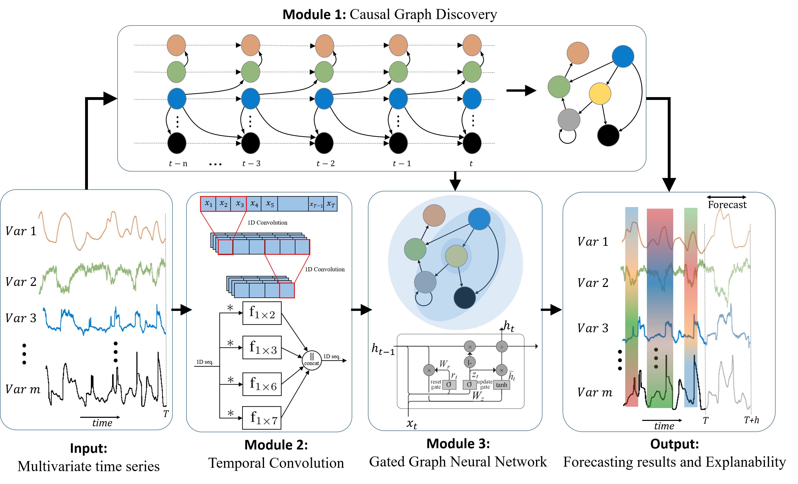

# Electricity Demand Forecasting Using eXplainable Causal Graph Neural Network (X-CGNN)



This repository contains the code for our paper:

**[Electricity demand forecasting at distribution and household levels using explainable causal graph neural network](https://doi.org/10.1016/j.egyai.2024.100368)**  
✍ **Authors:** Amir Miraki, Pekka Parviainen, Reza Arghandeh  
📚 **Journal:** *Energy and AI, Volume 16 (2024)*  
🔓 **Open Access:** Published by Elsevier under [CC BY 4.0 License](http://creativecommons.org/licenses/by/4.0/)

In this work, we introduce a novel **eXplainable Causal Graph Neural Network (X-CGNN)** framework for **multivariate electricity demand forecasting** at both the **household** and **distribution** levels. X-CGNN leverages **causal inference**, **graph neural networks**, and **temporal convolutions** to provide **state-of-the-art accuracy** while ensuring **model interpretability**.

This approach addresses key challenges in power demand forecasting including capturing variable interdependencies and offering actionable insights for **smart grid operations** such as **load balancing**, **resource allocation**, and **grid reliability**.

---

## 📌 Key Features

- ✅ **Causal Graph Discovery:** Learns directed acyclic graphs (DAGs) from time series data to uncover causal dependencies.  
- ✅ **Graph Neural Networks:** Enhances spatial modeling using **Gated GNNs** driven by causality.  
- ✅ **Temporal Convolution:** Captures periodic and long-range temporal patterns through **dilated convolutions**.  
- ✅ **Intrinsic & Post-hoc Explainability:** Combines **global causal structure** and **local XAI (e.g., SHAP, LIME)** explanations.  
- ✅ **Multi-level Forecasting:** Validated on **household** and **distribution-level** real-world electricity demand datasets.  

---

## 🧠 Model Architecture

The X-CGNN framework is composed of the following modules:

- **1. Causal Graph Discovery Module (CGD):** Extracts causality graphs from multivariate time series using continuous optimization (NOTEARS).  
- **2. Temporal Convolution Module (TC):** Employs multiple dilated convolutions to capture diverse periodic patterns (e.g., daily/weekly).  
- **3. Graph Neural Network Module (GNN):** Applies Gated GNNs using the learned causal graph to model variable interactions for accurate forecasting.

---

## 📊 Use Cases

- **Household-Level Forecasting:** Predicting hourly electricity/heat consumption using weather and historical load data.  
- **Distribution-Level Forecasting:** Forecasting energy demand in multiple city zones using SCADA data and meteorological variables.

---

## 📈 Performance Highlights

- 🚀 Achieves **state-of-the-art results** in both short- and long-term forecasting tasks.  
- 📉 Outperforms classic models (AR, LSTM, XGBoost), and deep learning baselines (STGCN, MTGNN, Autoformer).  
- 💯 Delivers **over 50% improvement** in MAE/RMSE vs. LSTM for 2-hour predictions at household level.

---

## 💡 Explainability

- **Global**: Interpretable causal graphs showing meaningful sensor/variable relationships.  
- **Local**: Feature/time-step importance via SHAP, LIME, Feature Ablation, etc.  
- These insights guide optimal **sequence length** and support **model trust** in real-world deployments.

---

## 📝 Citation

If you find our work useful, please cite our paper:

```bibtex
@article{miraki2024electricity,
  title={Electricity demand forecasting at distribution and household levels using explainable causal graph neural network},
  author={Miraki, Amir and Parviainen, Pekka and Arghandeh, Reza},
  journal={Energy and AI},
  volume={16},
  pages={100368},
  year={2024},
  publisher={Elsevier},
  doi={10.1016/j.egyai.2024.100368}
}
